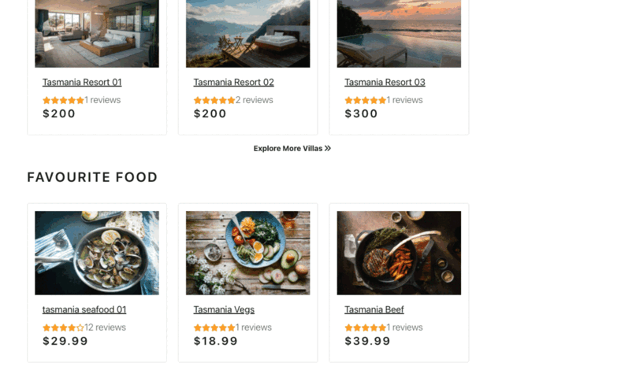
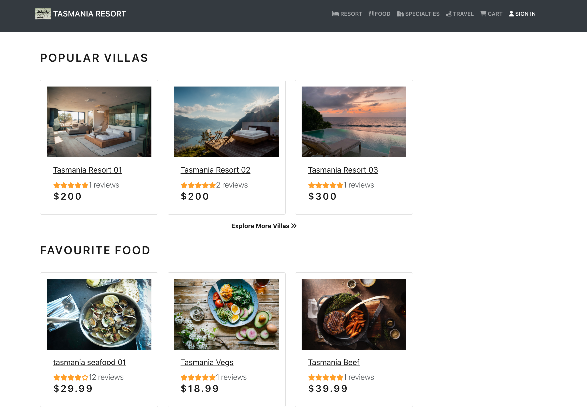
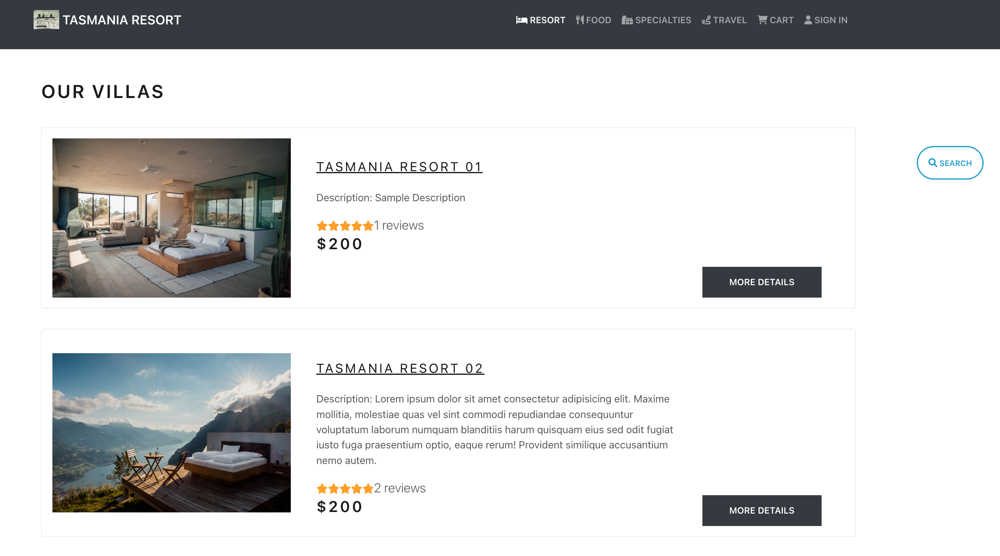
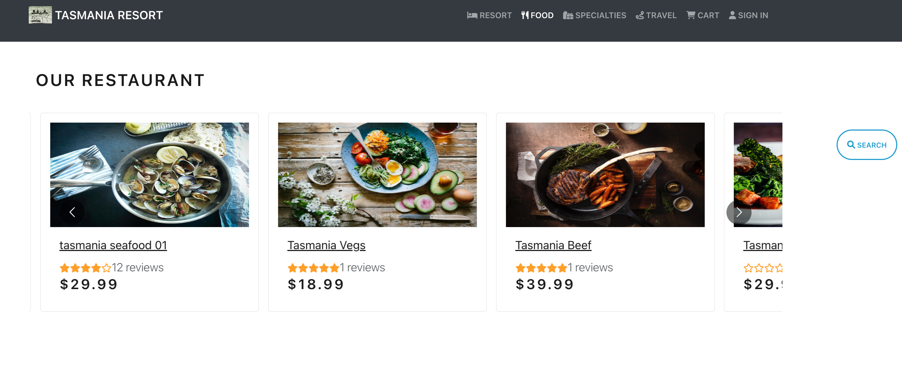
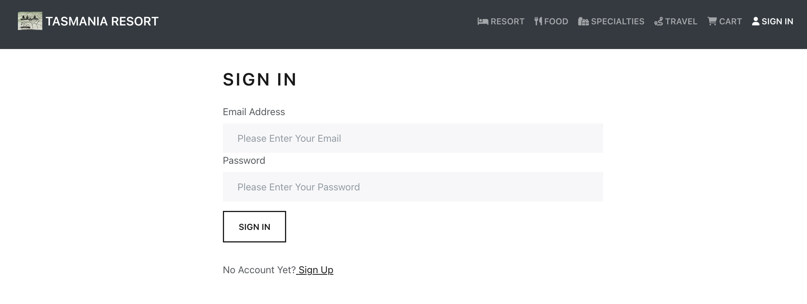
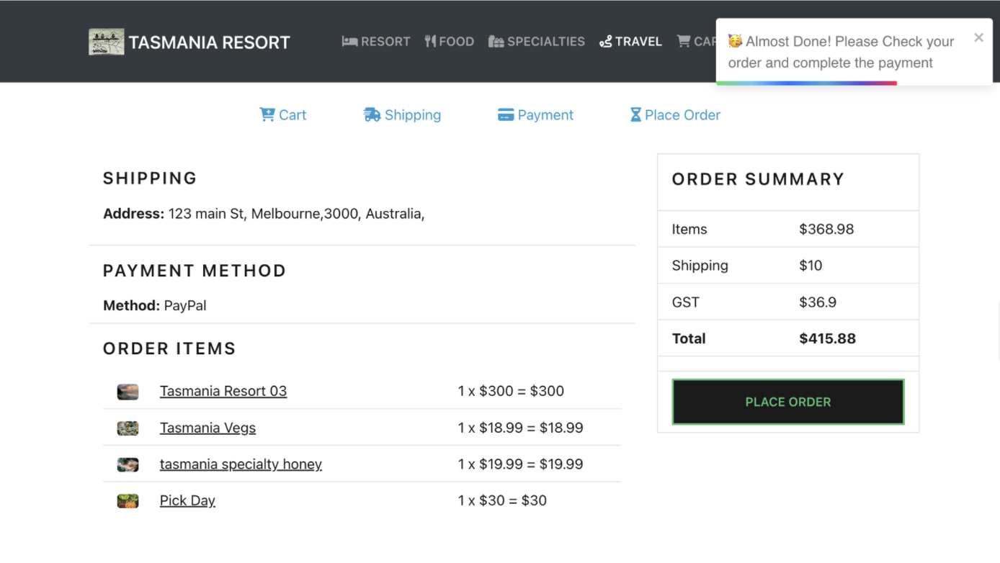
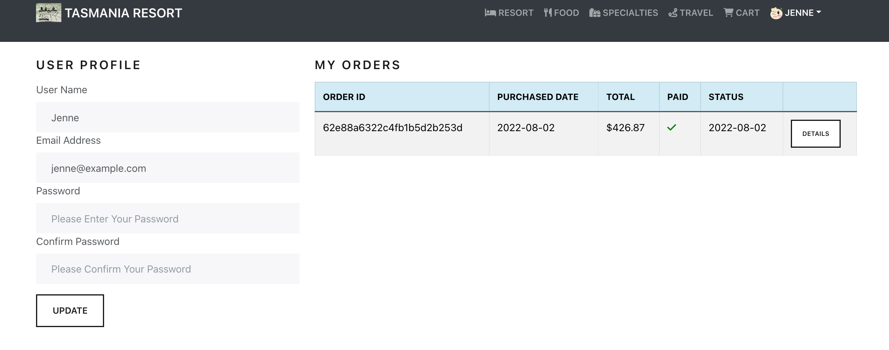
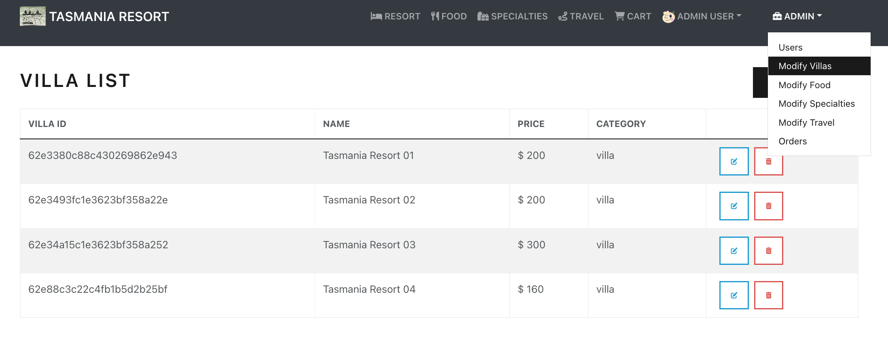
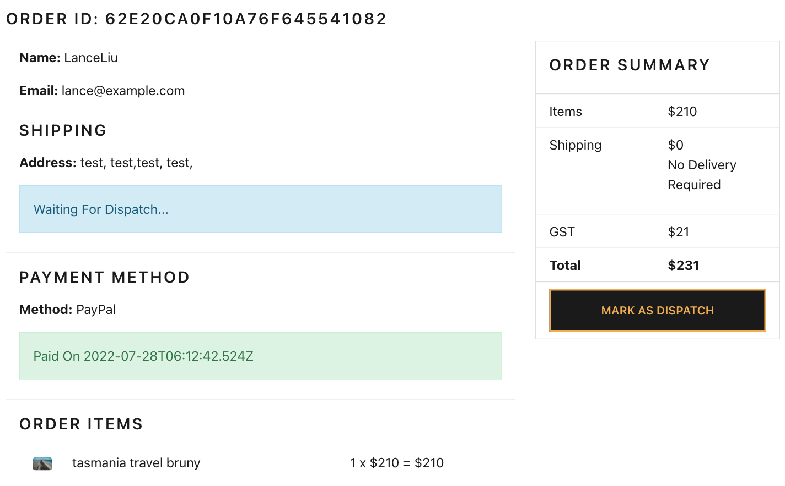
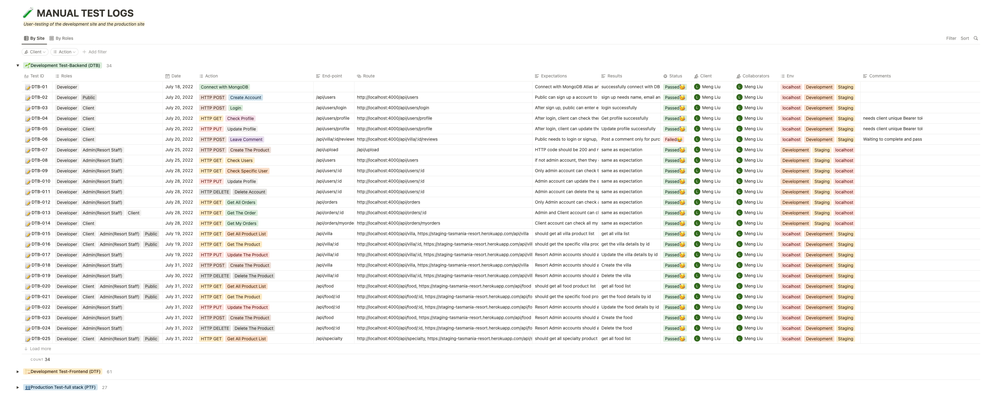

<h1 align="center"> Weclome to Tasmania Resort  Web Application</h1>

    

---

### :rainbow: About us

    

---

### :honeybee: Our Team

##### :seedling: Lance Liu

##### :seedling: Nora Sun

##### :seedling: Yun Li

---

### :computer: Web Application

:dart: [Deployment Site](https://tasmania-resort.netlify.app/)
https://tasmania-resort.netlify.app/

:high_brightness: [Front-end Repo](https://github.com/T3A2Group/client)
https://github.com/T3A2Group/client

:high_brightness: [Back-end Repo](https://github.com/T3A2Group/server)
https://github.com/T3A2Group/server

:open_file_folder: [More Docs](https://github.com/T3A2Group/T3A2_Part_A_Docs)
https://github.com/T3A2Group/T3A2_Part_A_Docs

---

### Table of Contents

- [:sparkles: Libraries and Dependencies](#sparkles-libraries-and-dependencies)
  - [Client Side](#client-side)
  - [Server Side](#server-side)
- [:globe_with_meridians: API Endpoints](#globe_with_meridians-api-endpoints)
- [:camera: Web Application Screenshots](#camera-web-application-screenshots)
  - [Home Page](#home-page)
  - [Product List Page](#product-list-page)
  - [Log in](#log-in)
  - [Make An Order(Clear Steps)](#make-an-orderclear-steps)
  - [Client Profile](#client-profile)
  - [Admin Toolkit](#admin-toolkit)
  - [Dispatch Order](#dispatch-order)
- [:telescope: Tests](#telescope-tests)
  - [Manual Test Logs](#manual-test-logs)
  - [Unit and Integration Tests](#unit-and-integration-tests)
- [:scroll: Project Management](#scroll-project-management)
- [:feet: Help documentation](#feet-help-documentation)
  - [Steps to install the app](#steps-to-install-the-app)

---

## :sparkles: Libraries and Dependencies

### Client Side

- <b>paypal/react-paypal-js ^7.8.1 :</b> react-paypal-js provides a solution to developers to abstract away complexities around loading the JS SDK. It enforces best practices by default so buyers get the best possible user experience. In our app, we use the PayPalScriptProvider options prop to configure the JS SDK, and allows client can complete payment in Paypal sanbox environment.
- <b>reduxjs/toolkit ^1.8.3 :</b> Includes utilities to simplify common use cases like store setup, creating reducers, immutable update logic, and more.Provides good defaults for store setup out of the box, and includes the most commonly used Redux addons built-in. In our app, we use redux to lift up 4 different products states, users states and order states to global state.
- <b>react-redux ^8.0.2 :</b> React Redux is the official React binding for Redux. It allows React components to read data from a Redux Store, and dispatch Actions to the Store to update data. In our app, you will find we used useDispatch, useSelector to dispatch actions to each related component to update state data.
- <b>axios ^0.27.2 :</b> Axios is a Javascript library used to perform HTTP requests for Nodejs and browsers. It supports the Promise API and makes it easy to send requests asynchronously. In our app, we use axios.create to create a new instance of axios with our config. Then our client, auth and admin system makes GET/POST/PUT/DELETE HTTP requests using the axios instance.
- <b>react ^18.2.0 :</b> React is a free and open-source front-end JavaScript library for building user interfaces based on UI components. It is maintained by Meta and a community of individual developers and companies. Our application dynamic client side UI is built with the react labs.
- <b>react-bootstrap ^2.4.0 :</b> React-Bootstrap is a component-based library that provides native Bootstrap components as pure React components. Our application UI layout is mainly used with React-Bootstrap.
- <b>react-dom ^18.2.0 :</b> ReactDOM is a package that provides DOM specific methods that can be used at the top level of a web app to enable an efficient way of managing DOM elements of the web page. This enables our app can use render() method to render components in the browser.
- <b>react-helmet ^6.1.0 :</b> React Helmet is a component to dynamically manage the document's head section. Some common use cases include setting the title , description , and meta tags for the document. In our app, when users go to each different main component, they will find each title also is different. For example, if user in the app home page, they can find the title: Welcome to Tas Resort | Home.
- <b>react-helmet-async ^1.3.0 :</b> React Helmet Async is a component which lets us control our document head using their React component. We use this lab to fixed some console error issues.
- <b>react-multi-carousel ^2.8.2 :</b> A lightweight production-ready Carousel that rocks supports multiple items and server-side rendering with no dependency. We mainly use it to make food list and specialty list screen UI layouts are different.
- <b>react-router-bootstrap ^0.26.2 :</b> The lab is integration between React Router v6 and React Bootstrap. In our app, we use LinkContainer to wrap our react bootstrap element to make it behave like a react router Link.
- <b>react-router-dom ^6.3.0 :</b> React Router DOM enables us to implement dynamic routing in our app. It allows for conditional rendering of our app's components in a single-page application based on the route being used in the URL. For example, in our different product screen component, we use navigateTo(-1) to allow users to click the go back button and always go gack to the previous page. If user clicks the product card to check product details from the home page, then when they click the go back button, they will go back to the home page, but if they check product details from the product list page, the go back button will take them back to the product list page.
- <b>react-scripts 5.0.1 :</b> react-scripts are simply scripts to run the build tools required to transform React JSX syntax into plain JavaScript programmatically.
- <b>react-toastify ^9.0.7 :</b> This lab allows us to add notifications to our app with ease. In our app, we mainly import this lab into action files, for example, when a user makes an order successfully, they will find a notification on the page, we think this can enhance the UI experience.
- <b>redux-devtools-extension ^2.13.9 :</b> We use this lab for debugging our application's state changes. We have used this lab and chrome redux devtools in our development environment to monitor actions and states change.
- <b>testing-library/jest-dom ^5.14.1 :</b> jest-dom is a companion library for Testing Library that provides custom DOM element matchers for Jest. In our app, we mainly use jest lab to do unit test in frontend.
- <b>testing-library/react ^13.0.0 :</b> React Testing Library is a testing utility tool that's built to test the actual DOM tree rendered by React on the browser. The goal of the library is to us write tests that resemble how a user would use our application.
- <b>testing-library/user-event ^13.2.1 :</b> user-event is a companion library for Testing Library that simulates user interactions by dispatching the events that would happen if the interaction took place in a browser.

### Server Side

- <b>bcryptjs ^2.4.3 :</b> It helps to avoid the sensitive data being visible from anyone. For security reason, we use this module to storing of user's password as hashed password instead of plaintext.
- <b>cors ^2.8.5 :</b> We use CORS to allow cross-origin access. CORS is a part of HTTP that lets our app server specify any other hosts from which a browser should permit loading of content.
- <b>cloudinary ^1.30.1 :</b> The Cloudinary Node SDK allows us to quickly and easily integrate our application with Cloudinary. In our app, when user upload image from frontend, the image will be stored in cloud, our backend database only store the image cloud URL.
- <b>dotenv ^16.0.1 :</b> DotEnv is a lightweight npm package that automatically loads environment variables from a . env file into the process. env object. In our app, we use it to config some sensitive data such as database and cloud keys.
- <b>express ^4.18.1 :</b> Express is a minimal and flexible Node.js web application framework that provides a robust set of features for web and mobile applications. We used express framework to bulid our app backend server consist of routes, middlewares and modules.
- <b>express-async-handler ^1.2.0 :</b> Simple middleware for handling exceptions inside of async express routes and passing them to us express error handlers. In our controllers, when using async handler wrap the async function with asynchandler, like asyncHandler(async fn()), so it saves us writing our own try/catch for async/await and passes error on to next.
- <b>jsonwebtoken ^8.5.1 :</b>It is an implementation of JSON Web Tokens. We mainly use it to generate jwt and share security information(auth information) between two parties — a client and a server.
- <b>mongoose ^6.4.4 :</b> Mongoose is an Object Data Modeling (ODM) library for MongoDB and Node. js. We use it to manage relationships between data, provides schema validation, and translate between objects in code and the representation of those objects in MongoDB.
- <b>morgan ^1.10.0 :</b> Morgan is a HTTP request logger middleware for Node. js. It simplifies the process of logging requests to our application. We only use it as a helper to check request logs in development environment.
- <b>multer ^1.4.5-lts.1 :</b> Multer is a node. js middleware for handling multipart/form-data , which is primarily used for uploading files. We use it to handle upload images only at this stage.
- <b>nodemon ^2.0.19 :</b> Nodemon is a tool that helps develop Node. js based applications by automatically restarting the node application when file changes in the directory are detected. In our development environment, we use npm run server to trigger script nodemon server.js, then nodemon will help us automatically restarting the server when we change files.
- <b>node-mocks-http ^1.11.0 :</b> It is used for testing our web server that have code that requires mockups of the request and response objects.
- <b>supertest ^6.2.4 :</b> It is a Node. js library that helps developers test APIs. We use it to test send requests (GET, POST, PUT, DELETE ) and fetch responses.
- <b>jest ^28.1.3 :</b> Jest is a JavaScript testing framework designed to ensure correctness of any JavaScript codebase. At server side, we use Jest for Unit Testing.
- <b>babel-jest ^28.1.3 :</b> It is is automatically installed when installing Jest and will automatically transform files if a babel configuration exists in your project.

---

## :globe_with_meridians: API Endpoints

| Product Villa               | Product Food               | Product Specialty               | Product Travel               |
| --------------------------- | -------------------------- | ------------------------------- | ---------------------------- |
| GET /api/villa              | GET /api/food              | GET /api/specialty              | GET /api/travel              |
| GET /api/villa/:id          | GET /api/food/:id          | GET /api/specialty/:id          | GET /api/travel/:id          |
| PUT /api/villa/:id          | PUT /api/food/:id          | PUT /api/specialty/:id          | PUT /api/travel/:id          |
| POST /api/villa             | POST /api/food             | POST /api/specialty             | DELETE /travel/:id           |
| DELETE /api/villa/:id       | DELETE /api/food/:id       | DELETE /api/specialty/:id       | DELETE /api/travel/:id       |
| POST /api/villa/:id/reviews | POST /api/food/:id/reviews | POST /api/specialty/:id/reviews | POST /api/travel/:id/reviews |

| Authentication         | Orders                   | Upload Image     |
| ---------------------- | ------------------------ | ---------------- |
| POST /api/users        | GET /api/orders/:id      | POST /api/upload |
| POST /api/users/login  | GET /api/orders/myorders |                  |
| PUT /api/users/profile |                          |                  |
| GET /api/users/profile |                          |                  |
| GET /api/users         |                          |                  |
| GET /api/users/:id     |                          |                  |
| PUT /api/users/:id     |                          |                  |
| Delete /api/users/:id  |                          |                  |

---

## :camera: Web Application Screenshots

### Home Page

### Product List Page

### Log in

### Make An Order(Clear Steps)

### Client Profile

### Admin Toolkit

### Dispatch Order

---

## :telescope: Tests

### Manual Test Logs

https://tasmania-resort.netlify.app/ (Please click to find more)

### Unit and Integration Tests

---

## :scroll: Project Management

---

## :feet: Help documentation

### Steps to install the app

- Make a fork of this repo
- Clone your fork to your local development environment
- For Backend:
  - Requirement:
    - Node.js v16.15.1
    - MongoDB Atlas, please user your MongoDB Atlas connection to instead of db.js file: process.env.MONGO_URI
  - Use `$ npm install` to install npm packages and dependencies.
  - You can run `$npm run data:import`, this command will run the seeder.js file to seed dummy data in your local environment.
  - In your terminal, please run `$ npm run server` to start the server, if everything is ok, you should see:
    - Server running in development mode on port 4000
    - MongoDB connected: (your mongodb connection)
- For Frontend:
  - Use `$ npm install` or `$ yarn` to install npm packages and dependencies.
  - If you have changed the backend server port, please make sure update the frontend package.json proxy as well.
  - In your terminal, please run `$npm start` or `$yarn start` to start react.
  - If you seeded data in your server, please find users account details in backend: data folder, users.js
  - Have fun :blush:
