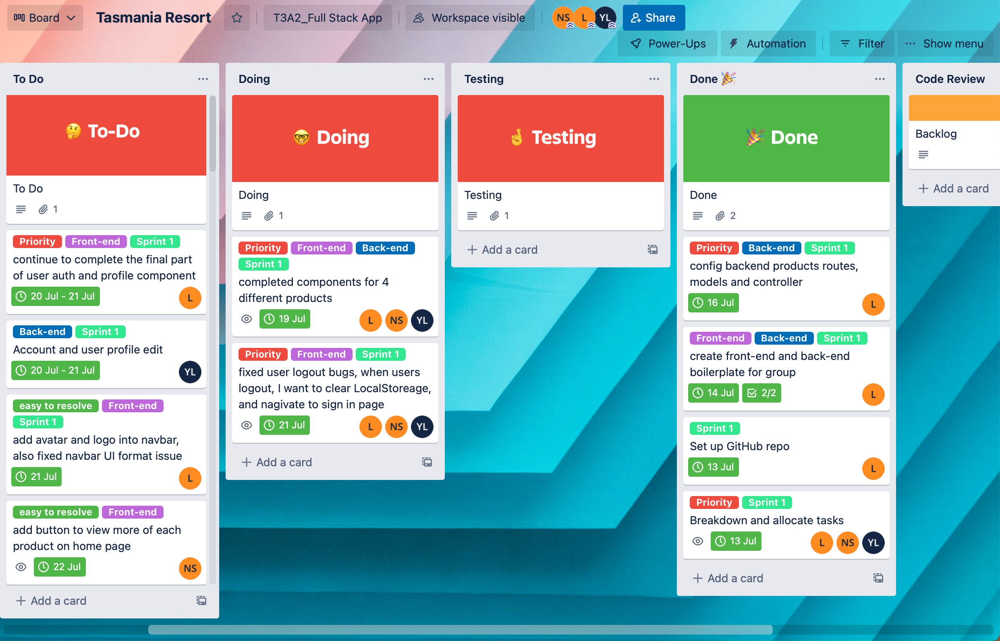
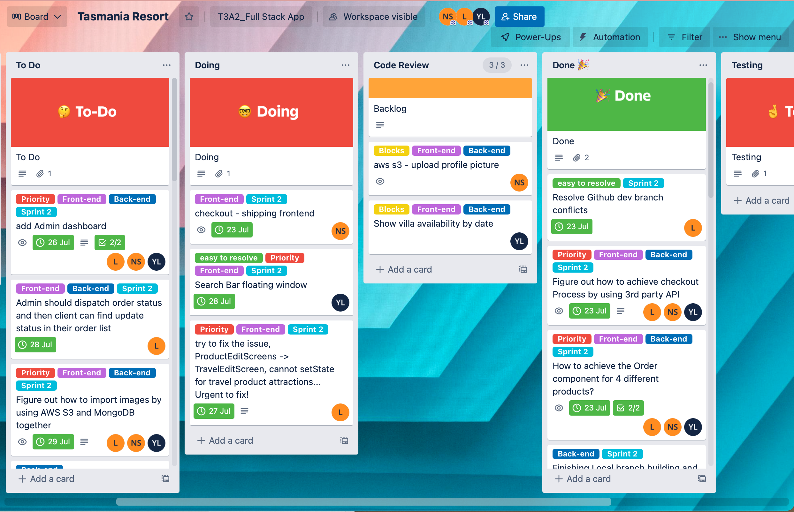
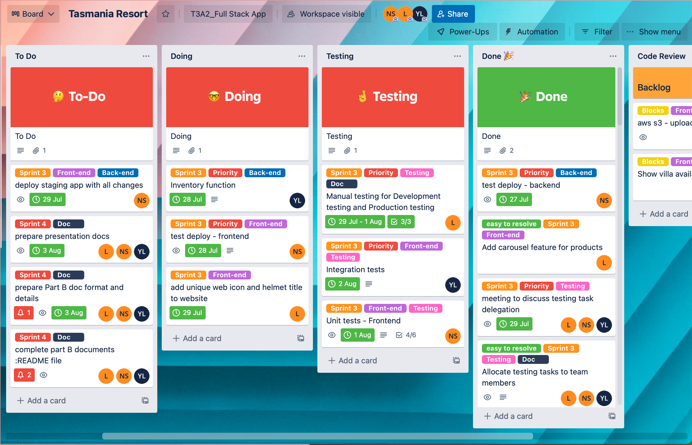
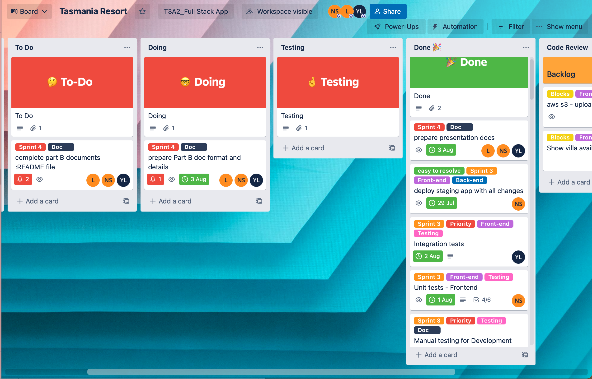

<h1 align="center"> Weclome to Tasmania Resort  Web Application</h1>

    

---

### :rainbow: About us

    

---

### :honeybee: Our Team

##### :seedling: Lance Liu [Github Profile](https://github.com/lanceliumeng)

##### :seedling: Nora Sun [Github Profile](https://github.com/jssnora)

##### :seedling: Yun Li [Github Profile](https://github.com/sam-lee-py)

---

### :computer: Web Application

:dart: [Deployment Site](https://tasmania-resort.netlify.app/)
https://tasmania-resort.netlify.app/

:high_brightness: [Front-end Repo](https://github.com/T3A2Group/client)
https://github.com/T3A2Group/client

:high_brightness: [Back-end Repo](https://github.com/T3A2Group/server)
https://github.com/T3A2Group/server

:open_file_folder: [More Docs](https://github.com/T3A2Group/T3A2_Part_A_Docs)
https://github.com/T3A2Group/T3A2_Part_A_Docs

:microphone: [Our Presentation File](https://www.canva.com/design/DAFIIJH6s_w/INyze_rft1E59K7u1TFxjg/view?utm_content=DAFIIJH6s_w&utm_campaign=designshare&utm_medium=link&utm_source=viewer)

---

### Table of Contents

- [:sparkles: Libraries and Dependencies](#sparkles-libraries-and-dependencies)
  - [Client Side](#client-side)
  - [Server Side](#server-side)
- [:globe_with_meridians: API Endpoints](#globe_with_meridians-api-endpoints)
- [:camera: Web Application Screenshots](#camera-web-application-screenshots)
  - [Home Page](#home-page)
  - [Product List Page](#product-list-page)
  - [Log in](#log-in)
  - [Make An Order(Clear Steps)](#make-an-orderclear-steps)
  - [Client Profile](#client-profile)
  - [Admin Toolkit](#admin-toolkit)
  - [Dispatch Order](#dispatch-order)
- [:telescope: Tests](#telescope-tests)
  - [Manual Test Logs](#manual-test-logs)
  - [Unit and Integration Tests](#unit-and-integration-tests)
- [:scroll: Project and Task Management](#scroll-project-and-task-management)
- [:feet: Help documentation](#feet-help-documentation)
  - [Steps to install the app](#steps-to-install-the-app)
- [:pushpin: Limitations](#pushpin-limitations)

---

## :sparkles: Libraries and Dependencies

### Client Side

    
<b>paypal/react-paypal-js ^7.8.1</b>

    react-paypal-js provides a solution to developers to abstract away complexities around loading the JS SDK. It enforces best practices by default so buyers get the best possible user experience. In our app, we use the PayPalScriptProvider options prop to configure the JS SDK, and allows client can complete payment in Paypal sanbox environment.

    
<b>reduxjs/toolkit ^1.8.3</b>

    Includes utilities to simplify common use cases like store setup, creating reducers, immutable update logic, and more.Provides good defaults for store setup out of the box, and includes the most commonly used Redux addons built-in. In our app, we use redux to lift up 4 different products states, users states and order states to global state.

    
<b>react-redux ^8.0.2</b>

    React Redux is the official React binding for Redux. It allows React components to read data from a Redux Store, and dispatch Actions to the Store to update data. In our app, you will find we used useDispatch, useSelector to dispatch actions to each related component to update state data.

    
<b>axios ^0.27.2</b>

    Axios is a Javascript library used to perform HTTP requests for Nodejs and browsers. It supports the Promise API and makes it easy to send requests asynchronously. In our app, we use axios.create to create a new instance of axios with our config. Then our client, auth and admin system makes GET/POST/PUT/DELETE HTTP requests using the axios instance.

    
<b>react ^18.2.0</b> 

    React is a free and open-source front-end JavaScript library for building user interfaces based on UI components. It is maintained by Meta and a community of individual developers and companies. Our application dynamic client side UI is built with the react labs.

    
<b>react-bootstrap ^2.4.0</b>

    React-Bootstrap is a component-based library that provides native Bootstrap components as pure React components. Our application UI layout is mainly used with React-Bootstrap.

  

    
<b>react-dom ^18.2.0</b>

    ReactDOM is a package that provides DOM specific methods that can be used at the top level of a web app to enable an efficient way of managing DOM elements of the web page. This enables our app can use render() method to render components in the browser.

    
<b>react-helmet ^6.1.0 :</b>

    React Helmet is a component to dynamically manage the document's head section. Some common use cases include setting the title , description , and meta tags for the document. In our app, when users go to each different main component, they will find each title also is different. For example, if user in the app home page, they can find the title: Welcome to Tas Resort | Home.

    
<b>react-helmet-async ^1.3.0</b>

    React Helmet Async is a component which lets us control our document head using their React component. We use this lab to fixed some console error issues.

    
<b>react-multi-carousel ^2.8.2</b>

    A lightweight production-ready Carousel that rocks supports multiple items and server-side rendering with no dependency. We mainly use it to make food list and specialty list screen UI layouts are different.

    
<b>react-router-bootstrap ^0.26.2</b>

    The lab is integration between React Router v6 and React Bootstrap. In our app, we use LinkContainer to wrap our react bootstrap element to make it behave like a react router Link.

    
<b>react-router-dom ^6.3.0</b>

    React Router DOM enables us to implement dynamic routing in our app. It allows for conditional rendering of our app's components in a single-page application based on the route being used in the URL. For example, in our different product screen component, we use navigateTo(-1) to allow users to click the go back button and always go gack to the previous page. If user clicks the product card to check product details from the home page, then when they click the go back button, they will go back to the home page, but if they check product details from the product list page, the go back button will take them back to the product list page.

    
<b>react-scripts 5.0.1</b>

    react-scripts are simply scripts to run the build tools required to transform React JSX syntax into plain JavaScript programmatically.

    
<b>react-toastify ^9.0.7</b>

    This lab allows us to add notifications to our app with ease. In our app, we mainly import this lab into action files, for example, when a user makes an order successfully, they will find a notification on the page, we think this can enhance the UI experience.

    
<b>redux-devtools-extension ^2.13.9</b>

    We use this lab for debugging our application's state changes. We have used this lab and chrome redux devtools in our development environment to monitor actions and states change.

    
<b>testing-library/jest-dom ^5.14.1</b>

    jest-dom is a companion library for Testing Library that provides custom DOM element matchers for Jest. In our app, we mainly use jest lab to do unit test in frontend.

    
<b>testing-library/react ^13.0.0</b>

    React Testing Library is a testing utility tool that's built to test the actual DOM tree rendered by React on the browser. The goal of the library is to us write tests that resemble how a user would use our application.

    
<b>testing-library/user-event ^13.2.1</b>

    user-event is a companion library for Testing Library that simulates user interactions by dispatching the events that would happen if the interaction took place in a browser.

    
<b>cypress ^10.4.0</b>

    Cypress is a purely JavaScript-based front-end testing tool built for the modern web. We use it to do unit test admin working flow and users working flow.

### Server Side

    
<b>bcryptjs ^2.4.3</b>

    It helps to avoid the sensitive data being visible from anyone. For security reason, we use this module to storing of user's password as hashed password instead of plaintext.

    
<b>cors ^2.8.5</b>

    We use CORS to allow cross-origin access. CORS is a part of HTTP that lets our app server specify any other hosts from which a browser should permit loading of content.

    
<b>cloudinary ^1.30.1</b>

    The Cloudinary Node SDK allows us to quickly and easily integrate our application with Cloudinary. In our app, when user upload image from frontend, the image will be stored in cloud, our backend database only store the image cloud URL.

    
<b>dotenv ^16.0.1</b>

    DotEnv is a lightweight npm package that automatically loads environment variables from a . env file into the process. env object. In our app, we use it to config some sensitive data such as database and cloud keys.

  

    
<b>express ^4.18.1</b>

    Express is a minimal and flexible Node.js web application framework that provides a robust set of features for web and mobile applications. We used express framework to bulid our app backend server consist of routes, middlewares and modules.

    
<b>express-async-handler ^1.2.0</b>

    Simple middleware for handling exceptions inside of async express routes and passing them to us express error handlers. In our controllers, when using async handler wrap the async function with asynchandler, like asyncHandler(async fn()), so it saves us writing our own try/catch for async/await and passes error on to next.

    
<b>jsonwebtoken ^8.5.1</b>

    It is an implementation of JSON Web Tokens. We mainly use it to generate jwt and share security information(auth information) between two parties — a client and a server.

    
<b>mongoose ^6.4.4</b>

    Mongoose is an Object Data Modeling (ODM) library for MongoDB and Node. js. We use it to manage relationships between data, provides schema validation, and translate between objects in code and the representation of those objects in MongoDB.

    
<b>morgan ^1.10.0</b>

    Morgan is a HTTP request logger middleware for Node. js. It simplifies the process of logging requests to our application. We only use it as a helper to check request logs in development environment.

    
<b>multer ^1.4.5-lts.1</b>

    Multer is a node. js middleware for handling multipart/form-data , which is primarily used for uploading files. We use it to handle upload images only at this stage.

    
<b>nodemon ^2.0.19</b>

    Nodemon is a tool that helps develop Node. js based applications by automatically restarting the node application when file changes in the directory are detected. In our development environment, we use npm run server to trigger script nodemon server.js, then nodemon will help us automatically restarting the server when we change files (devDependency).

    
<b>supertest ^6.2.4 </b>

    It is a Node. js library that helps developers test APIs. We use it to test send requests (GET, POST, PUT, DELETE ) and fetch responses (devDependency).

    
<b>jest ^28.1.3 </b>

    Jest is a JavaScript testing framework designed to ensure correctness of any JavaScript codebase. At server side, we use Jest for Unit Testing (devDependency).

    
<b>babel-jest ^28.1.3 </b>

    It is is automatically installed when installing Jest and will automatically transform files if a babel configuration exists in our project (devDependency).

---

## :globe_with_meridians: API Endpoints

| Product Villa               | Product Food               | Product Specialty               | Product Travel               |
| --------------------------- | -------------------------- | ------------------------------- | ---------------------------- |
| GET /api/villa              | GET /api/food              | GET /api/specialty              | GET /api/travel              |
| GET /api/villa/:id          | GET /api/food/:id          | GET /api/specialty/:id          | GET /api/travel/:id          |
| PUT /api/villa/:id          | PUT /api/food/:id          | PUT /api/specialty/:id          | PUT /api/travel/:id          |
| POST /api/villa             | POST /api/food             | POST /api/specialty             | DELETE /travel/:id           |
| DELETE /api/villa/:id       | DELETE /api/food/:id       | DELETE /api/specialty/:id       | DELETE /api/travel/:id       |
| POST /api/villa/:id/reviews | POST /api/food/:id/reviews | POST /api/specialty/:id/reviews | POST /api/travel/:id/reviews |

| Authentication         | Orders                   | Upload Image     |
| ---------------------- | ------------------------ | ---------------- |
| POST /api/users        | GET /api/orders/:id      | POST /api/upload |
| POST /api/users/login  | GET /api/orders/myorders |                  |
| PUT /api/users/profile |                          |                  |
| GET /api/users/profile |                          |                  |
| GET /api/users         |                          |                  |
| GET /api/users/:id     |                          |                  |
| PUT /api/users/:id     |                          |                  |
| Delete /api/users/:id  |                          |                  |

---

## :camera: Web Application Screenshots

### Home Page

### Product List Page

### Log in

### Make An Order(Clear Steps)

### Client Profile

### Admin Toolkit

### Dispatch Order

---

## :telescope: Tests

### Manual Test Logs

[Please click to find more](https://dent-beetle-c9a.notion.site/d21c3c894c28415d9caeba537722576c?v=43fbbca1288f4b13b3ad3fac40d7b5a0)

### Unit and Integration Tests

- [Cypress Test Result Logs](https://github.com/T3A2Group/client/tree/main/cypress/testResult)
- [Cypress Test Result Logs Link](https://dashboard.cypress.io/projects/9eyfka/runs/1/test-results?actions=%5B%5D&browsers=%5B%5D&groups=%5B%5D&isFlaky=%5B%5D&modificationDateRange=%7B%22startDate%22%3A%221970-01-01%22%2C%22endDate%22%3A%222038-01-19%22%7D&orderBy=EXECUTION_ORDER&oses=%5B%5D&specs=%5B%5D&statuses=%5B%5D&testingTypesEnum=%5B%5D)
- [Cypress Test All Specs Videos](https://dashboard.cypress.io/projects/9eyfka/runs/1/specs)

- [Client Side Test Result Screenshot](https://github.com/T3A2Group/client/blob/main/src/test/Unit-test-Screenshots.jpg)

- [Server Side Test Result Logs and Screenshot](https://github.com/T3A2Group/server/tree/main/tests/test-result)

---

## :scroll: Project and Task Management

Our Trello Link : [Trello URL](https://trello.com/b/Rqmp3DFm/tasmania-resort)

We adopted an agile approach to manage this project with task management done through the use of a Trello board.

In the initial planning phase of the project, we met with our client Tasmania Resort to gather their requirements for this project and collected user stories to help conceptualise ideas for features and functions.

At the start of the development phase, we had a high level meeting to discuss how the project was going to be managed. We decided to continue using the agile approach of splitting the workflow into sprints based on the priority of tasks.

We revisited the user stories in detail and decided to split the project into 4 sprints of 5 days each.

- Sprint 1: Create MVP (minimum viable product).
  In this sprint, we built the basic overall structure of the website consisting of all essential functions(all priority 1) and basic UI. We came across a couple of blockers such as how to best set up our product schemas. We called meetings to talk through these issues and were able to resolve these quickly which led to a successful delivery of the MVP by the end of sprint 1.

  

- Sprint 2: Priority 2 features and functions.
  We tried to implement features that are ranked priority 2 during this sprint. We encountered some blockers that delayed our progress and by the second half of the sprint, we realised that we will need to review the remaining features to be implemented in this sprint as it was unlikely that we would be able to implement them all. Our team first had an internal discussion regarding which features may need to be put into the backlog to be worked on at a later date. Then we met with our client to communicate these delays and reprioritised tasks according to the client's preference. Our client was happy to leave the 'edit profile picture' feature to be implemented at a later date.

  

- Sprint 3: Refactor code, improve UI, manual, unit and integration tests, deployment
  This sprint focuses on refining the end product which includes making the code more DRY, making further improvements to the UI, deploying the application and testing the application in development and production environments. We did not have major blockers in this sprint, however we did identify a couple of bugs in our business logic through testing. For example, a customer should only be allowed to leave a review for an item that they have actually purchased, not all products and basic inventory management (i.e. when an order is confirmed and marked as dispatched by admin, the level of stock for the products on the order will reduce accordingly). We were able to fix these before the end of the sprint and completed sprint 3 successfully.

  

- Sprint 4: Complete all documentation
  In this sprint, we prepare for the delivery of the final product by tidying up and completing the documentation.

  

Before the start of each sprint, we had a sprint planning meeting to go over the goals and tasks of the upcoming sprint to ensure everyone in the team is on the same page with what our priorities are. Daily stand up meetings were also held to discuss the task that each of us were working on, whether anyone has any blocks and what will be worked on next. At the end of each sprint, review meetings are held where we ran through and demoed the completed features to ensure that everyone (including our mock client Tasmania Resort) understand the work done and ensure our mock client is happy with the product.

In terms of task management, we added all tasks that we could think of to the 'to-do' column. When a card is assigned to a team member and is ready to be worked on, it is moved to the 'doing' column with an estimated due date assigned to it. Tasks that cannot be finished within the specified sprint are moved to the 'backlog' column to be worked on at a later date. Once the team member is done with the task, the card is moved to the 'done' column.

In each of the sprint planning meetings, we reviewed the cards to ensure that they were prioritised and marked accordingly. We ranked the tasks based on priority and difficulty. We marked tasks that have a high priorty and high difficulty level with a 'priority' tag and tried to tackle these early on in the sprint. Tasks that were identified as difficult but not essential to the overall progression of the project are marked as 'blocks', these cards are worked on at a later stage in each sprint and moved to the 'backlog' column if we are short on time. The straightforward and less complicated tasks are marked with an 'east to resolve' tag. As we added features and functions to the board, we progressively broke them down into individual tasks and assigned each task to a specific team member (or in some cases as described below, to multiple team members).

Our team consist of a diverse range of talents. Lance is very well rounded in both frontend and backend so he worked on tasks across both of these areas, building a solid base application for the team to add functions and features to. Yun has substantial backend knowledge so the trickier backend tasks were allocated to him. Nora wanted to grow her knowledge in the frontend so we allocated more frontend tasks to her. However, all our team members wanted to solidify our knowledge in all areas of the development process, so we aimed to ensure that each team member had a relatively even exposure across each of these areas.

For some of the more difficult tasks, or for those that were more difficult to split up into multiple smaller tasks we used a 'pair programming' approach (but with 3 people instead of 2) to ensure that all team members understood the codebase, and had the opoortunity to provide input on important parts of the code that would affect each of our individual tasks later. Lance was in the driver's seat for these pair programming sessions and was responsible for pushing the changes to Github.

In our day to day workflow, the team member would open a new feature branch when they start working on a new feature, regular commits and pushes are made to the feature branch until the feature is ready to be merged into the main branch. At this time, the team member would open a pull request on Github and have the code reviewed by other team members. We would often have a quick meeting to run through the changes, and if no adjustments are required, the pull request is approved and the feature is merged into the main development branch. Otherwise, we would talk through the adjustments needed and merge the feature after the changes are made.

As a team, we were able to coordinate and work together very well. As we are a small group of three, we were able to be flexible and cater to the needs of each team member. For example, when Nora was unwell, the team agreed to allocate simpler tasks to her while she was sick and when Yun was moving houses, we agreed to shift the workload from him for that period. Although we were all working from home which made it harder to physically chat about tasks, we all tried our best to keep communication open by using discord.

---

## :feet: Help documentation

### Steps to install the app

- Make a fork of this repo
- Clone your fork to your local development environment
- For Backend:
  - Requirement:
    - Node.js v16.15.1
    - MongoDB Atlas, please user your MongoDB Atlas connection to instead of db.js file: process.env.MONGO_URI
  - Use `$ npm install` to install npm packages and dependencies.
  - You can run `$npm run data:import`, this command will run the seeder.js file to seed dummy data in your local environment.
  - In your terminal, please run `$ npm run server` to start the server, if everything is ok, you should see:
    - Server running in development mode on port 4000
    - MongoDB connected: (your mongodb connection)
- For Frontend:
  - Use `$ npm install` or `$ yarn` to install npm packages and dependencies.
  - If you have changed the backend server port, please make sure update the frontend package.json proxy as well.
  - In your terminal, please run `$npm start` or `$yarn start` to start react.
  - If you seeded data in your server, please find users account details in backend: data folder, users.js
  - Have fun :blush:

---

## :pushpin: Limitations

In general, we are all satisfied with the website. Through the hard work of each team member day and night, this website has helped Tasmania Resort solve most companies' business needs. Everyone also learned a lot through this project, not only the knowledge of code but also how to carry out team collaboration, how to achieve each milestone according to agile development, and how to use each member's strength to bring more significant benefits to the team project. But at the same time, we also realize that this website still has some limitations.

- At this stage, the client only can do a standard search. We want to add advance search in the feature.
- We want to add more payment options(such as Apple pay, Google pay etc.) in the app. At this stage, the client only can use PayPal to complete payment by using a PayPal account or bank card.
- We couldn't achieve a complex booking system in our app. For example, we want to allow clients to choose a villa according to the date. If the client decides villa, we want to suggest some related products to them.
- We didn't add an email validation check function and secure password suggestion for the sign-up form. We want to add this to the app as well.
- Real-time chat system, when clients browse the website, we want to allow them to ask questions through a chat window, and resort admins can help clients to resolve some questions through chat.
